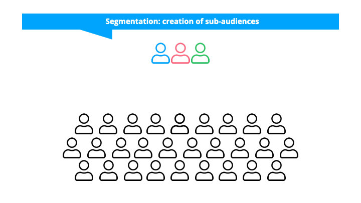
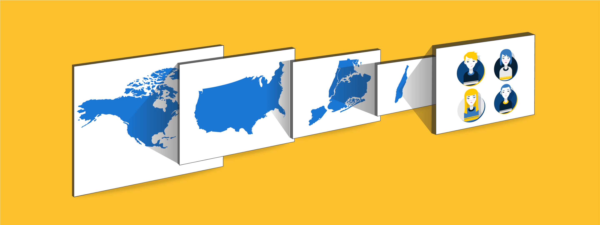

# 💼 CRM Analytics with FRM Analysis 💼

## 📜 Introduction 📜
This repository provides a sizzling hot 🔥 CRM analytics solution using the 🔝 RFM (Recency, Frequency, Monetary) analysis technique. CRM Analytics is an essential practice for businesses to gain insights into customer behavior, identify valuable customer segments, and tailor marketing strategies accordingly. The RFM analysis approach allows us to segment customers based on their transaction history, making it easier to target specific customer groups with personalized marketing efforts.

## 💡 RFM Analysis 💡
RFM analysis is a powerful method to segment customers based on three key dimensions:

1. 🔔 **Recency (R):** This metric measures the number of days since the customer's last purchase. The assumption is that customers who made recent purchases are more likely to be engaged and responsive.

2. 🔄 **Frequency (F):** Frequency refers to the total number of transactions made by each customer over a specific period. Frequent buyers are considered to be more loyal and valuable for the business.

3. 💰 **Monetary Value (M):** The monetary value is the total amount of money spent by each customer across all transactions. Customers with higher spending are of greater significance to the business.

By analyzing RFM metrics, we can divide customers into distinct segments, such as high-value customers, potential loyal customers, and customers requiring re-engagement.

## 📊 Dataset 📊
The dataset used for this analysis is assumed to be in a CSV format and should contain the following columns:

- `Invoice`: A unique identifier for each transaction.
- `StockCode`: A unique code for each stock item.
- `Description`: A description of the stock item.
- `Quantity`: The number of items purchased in each transaction.
- `InvoiceDate`: The date of the transaction.
- `Price`: The unit price of each item.
- `Customer ID`: A unique identifier for each customer.
- `Country`: The country of the customer.

Ensure that your dataset is cleaned, organized, and stored as `retail_data.csv` in the root directory of the project.

## 🛠️ Prerequisites 🛠️
Before running the CRM analytics with RFM analysis code, you need to have the following set up:

- **Python 3.9:** Make sure you have Python 3.9 installed on your machine to execute the analysis code.
- **Jupyter Notebook or JupyterLab:** You can use either Jupyter Notebook or JupyterLab to run the analysis code interactively.

## 🚀 Usage 🚀
Follow these steps to perform the CRM analytics with RFM analysis:

1. Clone this repository to your local machine using `git clone https://github.com/your_username/crm-analytics.git`.
2. Place your cleaned and formatted customer dataset as `customer_data.csv` in the root directory of the project.
3. Open the Jupyter Notebook or JupyterLab and navigate to the project folder.
4. Run the Jupyter Notebook `RFM.ipynb` and follow the instructions provided to execute the RFM analysis.

## 📈 Results 📈
Upon running the RFM analysis on your customer dataset, you will obtain valuable insights, including:

- **High-value customers:** Customers who recently made frequent purchases and spent a considerable amount.
- **Potential loyal customers:** Customers who have spent significantly but have not made frequent purchases recently.
- **Customers requiring re-engagement:** Customers who made infrequent purchases and have not been active for some time.

These insights will enable you to formulate targeted marketing strategies, improve customer retention, and maximize the return on marketing efforts.

## 👥 Contributing 👥
Contributions to this project are highly appreciated! If you find any bugs, have suggestions for improvements, or want to add new features, feel free to open an issue or submit a pull request. Let's work together to enhance the CRM analytics solution.

## 📄 License 📄
This project is licensed under the [MIT License](LICENSE).

---

We hope this repository proves to be smoking hot 🔥 in analyzing your customer data with RFM analysis. If you have any questions or need further assistance, please feel free to contact us.

*Note: The CRM analytics image used in this README is for illustrative purposes only and does not represent actual data or results.* 😎
